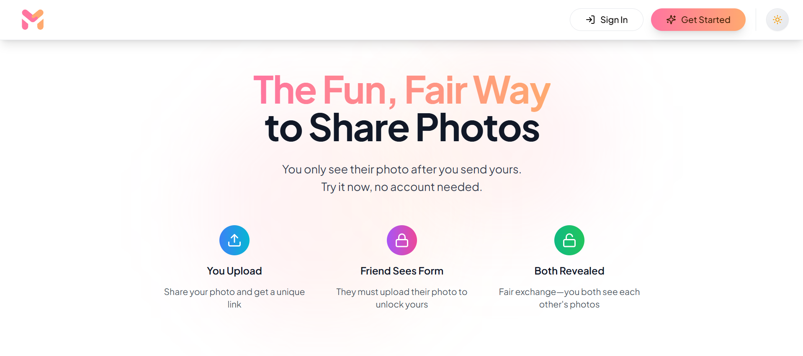
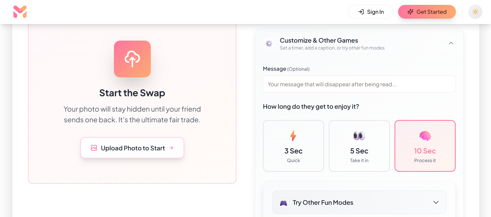

# 🔄 Mentisy: The Fair Photo Swap App

   

👉 Live Demo: https://www.mentisy.com

### 🚨 The Problem
We've all been there: You're chatting with a friend, they ask for a photo, you send one... and **they leave you on "seen."** The exchange is unfair.

### ✅ The Solution: PicSwap
Mentisy is a Progressive Web App (PWA) built to solve the "you send first" standoff. It ensures a **fair trade** using a "lock-and-blur" mechanic. You only see their photo *after* you send yours.

---

## ✨ Key Features

### 🔄 PicSwap (The Hero Mechanic)
* **Fair Exchange Logic:** Photos are blurred and locked on the server until both parties contribute.
* **Real-time Reveal:** Using Convex subscriptions, both screens unlock instantly the moment the trade is complete.

### 🚀 Frictionless Guest Mode
* **No Sign-up Required:** Users can create and complete a swap anonymously to lower entry barriers.
* **Persistent Sessions:** LocalStorage handles guest identity so users don't lose their swaps if they reload.

### 🛡️ Safety & Privacy
* **Smart Overlay:** A custom CSS/JS layer preventing sneaky right-click saves.
* **Auto-Expiry:** Swaps can be set to expire, ensuring photos don't live on the server forever.

### 📱 PWA (Progressive Web App)
* **Installable:** Users can install Mentisy to their home screen for a native app experience.
* **Offline Capable:** Service workers cache core assets for fast loading on Indian 4G networks.

---

## 🛠️ Tech Stack

This project was built to demonstrate **modern, scalable system design**:

* **Frontend:** Next.js 14 (App Router), React, TypeScript, Tailwind CSS
* **Backend & Database:** Convex (Real-time database, Serverless functions)
* **Authentication:** Clerk (for "Pro" accounts) + Custom Anonymous Auth (for Guest Mode)
* **State Management:** Zustand
* **UI Components:** Shadcn/UI + Lucide React + Framer Motion

---

## 📸 Screenshots

| Landing Page | The Swap Form |
|:---:|:---:|
|  |  |
| *The new frictionless Hero section* | *Fair trade in action* |

---

## ⚡ Getting Started Locally

Want to see the code in action?

1. **Clone the repo**
   ```bash
   git clone https://github.com/shubham-builds/mentisy.git
   cd mentisy

2. Install dependencies
   ```bash
   npm install

3. Create your environment file
   ```bash
   cp .env.example .env.local

Then open .env.local and fill in the required values:
NEXT_PUBLIC_CONVEX_URL
CLERK_PUBLISHABLE_KEY
CLERK_SECRET_KEY
NEXT_PUBLIC_CLERK_PUBLISHABLE_KEY
Any other project-specific environment variables

4. Start the Convex backend
   ```bash
   npx convex dev
This will generate your Convex URL — paste it into:
   ```bash
   NEXT_PUBLIC_CONVEX_URL=

5. Start the Next.js development server
   ```bash
   npm run dev
6. Open Mentisy locally
   visit:
   ```bash
   http://localhost:3000

   


